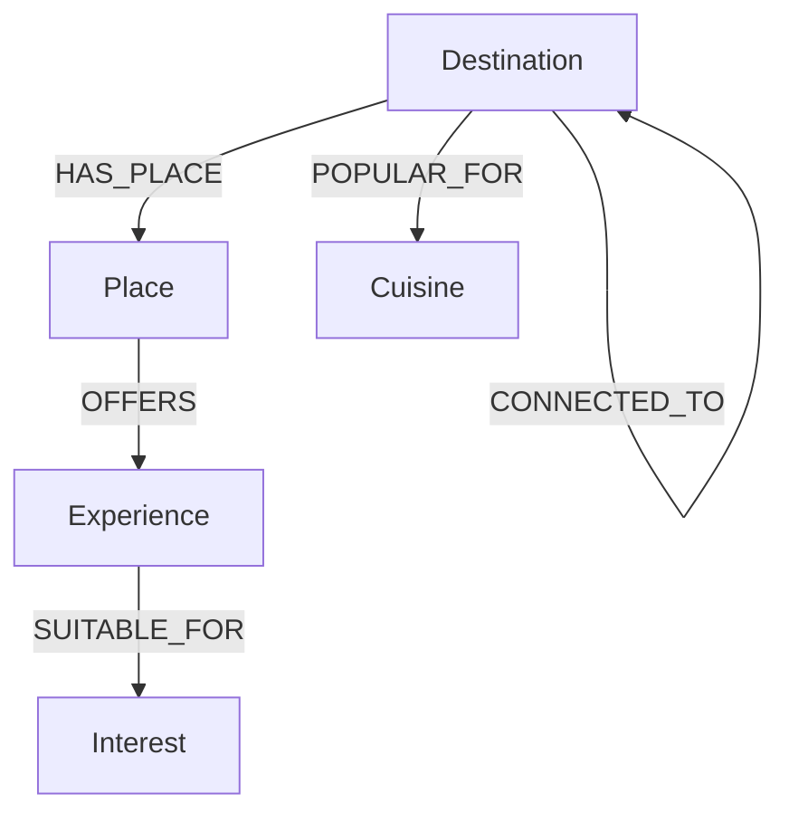

# Explore Your Destination

Discover destinations, places, and experiences through the connections that make every journey interesting.

[](#)
[](#)
[](#)
[](#)
[](#)
[](#)

---

## Overview

Travel discovery is often organized around isolated destination listings and dry search filters. **Explore Your Destination** takes a different approach: it is a consumer travel discovery product that organizes travel information as an interconnected journey. By linking cities with local landmarks, culinary profiles, travel interests, and neighboring stopovers, the application guides users through an intuitive trail of discovery.

### What users can do:
1. **Browse Destinations**: View destinations in an editorial asymmetric grid.
2. **Select Travel Vibes**: Choose from curated categories (e.g. *History*, *Photography*, *Food*, *Nature*, *Adventure*).
3. **Discover Matching Destinations**: Find the places that perfectly match selected travel interests.
4. **Explore Places & Activities**: Deep-dive into local historical sites, palaces, monuments, and experiences.
5. **View Cuisines**: Explore regional local flavours.
6. **Plan Multi-Stop Journeys**: Click through connected destinations to plan a continuous route.

---

## Why a Graph Database?

In travel discovery, the most interesting questions are **relationship-oriented**:
* *"Which specific experiences in Jaipur connect back to my interest in history?"*
* *"If I am visiting Amer Fort, what related experiences can I try there?"*
* *"If I finish exploring Jaipur, which connected cities should be my next stop?"*

In a traditional database, querying these relationships requires chaining multiple tables and foreign keys. In **CognoDB**, relationships are first-class citizens. Using a graph database allows us to:
1. **Traverse Paths Directly**: Querying the path from `Destination → Place → Experience → Interest` is a single path traversal, not a series of table joins.
2. **Implement Intuitive Discovery**: The frontend is powered by openCypher path queries that naturally retrieve context, such as explaining *why* a destination matches (e.g. *"Because you love history, you'll find places like Amer Fort offering a wonderful Heritage Walk"*).
3. **Compute Journey Trails**: Moving from one destination to another uses simple edge walks (`CONNECTED_TO`), enabling a seamless, loop-based exploration trail.

---

## Why Not Just a Relational Database?

While a relational database (like PostgreSQL) can model this data, relationship-heavy discovery incurs query complexity and performance costs as path length increases. 

| Feature / Problem | Relational Approach | Graph Approach |
| :--- | :--- | :--- |
| **Destination → Place → Experience** | Multi-table joins (`destinations` ⋈ `places` ⋈ `experiences`) | Direct pointer traversal |
| **Interest-Based Discovery** | Joins across association/join tables | Natural relationship traversal |
| **Multi-Hop Path Discovery** | Complex, slow CTEs (Common Table Expressions) | Native path matching (`-[:CONNECTED_TO*1..3]->`) |
| **Evolving Travel Schema** | Altering tables, managing foreign keys, null columns | Creating new edge relationships on the fly |

> **Conclusion**: A relational database is capable of storing this data, but the query model becomes complicated. The graph model matches the human mental model of travel—a web of connected places and experiences—directly expressing these connections in code.

---

## Core User Journey

```
User enters the application
  │
  ├──► Choose a travel vibe (Interest)
  │      │
  │      └──► Discover matching destinations (Path Traversal)
  │
  └──► Select a destination
         │
         ├──► Browse local places to discover
         ├──► View local flavours (Cuisines)
         ├──► See recommended activities (Experiences)
         │
         └──► View "Where could you go next?" ──► Navigate to connected destination
```

---

## Graph Data Model

The database schema represents a rich web of relationships between destinations, interests, and places:



### Node Labels
* `Destination`: Represents a city or region (e.g. `Jaipur`, `Goa`, `Agra`).
* `Place`: A physical landmark or attraction (e.g. `Amer Fort`, `Baga Beach`).
* `Experience`: An activity you can participate in (e.g. `Heritage Walk`, `Water Sports`).
* `Interest`: A traveler interest vibe category (e.g. `History`, `Adventure`, `Beaches`).
* `Cuisine`: Regional food styles (e.g. `Rajasthani`, `Goan`, `Street Food`).

### Relationships
* `(:Destination)-[:HAS_PLACE]->(:Place)`
* `(:Place)-[:OFFERS]->(:Experience)`
* `(:Experience)-[:SUITABLE_FOR]->(:Interest)`
* `(:Destination)-[:POPULAR_FOR]->(:Cuisine)`
* `(:Destination)-[:CONNECTED_TO]->(:Destination)` (Bidirectional travel routes between adjacent cities)

---

## Core Cypher Queries

The application executes clean openCypher queries to fetch graph data.

### 1. Fetching Interests for a Destination
Traverses the path from a specific destination to its places, then to the experiences offered, and returns all unique suitable interests:
```cypher
MATCH (d:Destination {name: $destination})
      -[:HAS_PLACE]->(p:Place)
      -[:OFFERS]->(e:Experience)
      -[:SUITABLE_FOR]->(i:Interest)
RETURN DISTINCT i.name AS interest
ORDER BY interest
```

### 2. Discovering Destinations by Interest
Given a user interest (vibe), retrieves all matching destinations that offer relevant experiences:
```cypher
MATCH (d:Destination)
      -[:HAS_PLACE]->(p:Place)
      -[:OFFERS]->(e:Experience)
      -[:SUITABLE_FOR]->(i:Interest {name: $interest})
RETURN DISTINCT
  d.name AS destination,
  d.state AS state,
  d.country AS country
ORDER BY destination
```

### 3. Fetching Destination Details Graph
Retrieves a subgraph of connections up to 3 hops away from a given destination to construct visual connection trails:
```cypher
MATCH path = (d:Destination {name: $destination})
             -[:HAS_PLACE|OFFERS|SUITABLE_FOR*1..3]-(node)
RETURN path
LIMIT 100
```

---

## Engineering Architecture & Directory Structure

The application is structured as a decoupled client-server architecture:

```text
Explore Your Destination/
├── client/                     # Frontend React application (Vite + TS)
│   ├── public/                 # Static assets (custom favicon.svg brand mark)
│   ├── src/
│   │   ├── components/         # Reusable UI elements (Header, Cards, Common layouts)
│   │   ├── pages/              # Main route layouts (Explore, Destination, Discovery)
│   │   ├── services/           # API client layer (Axios service calls)
│   │   ├── types/              # TypeScript interface schemas
│   │   ├── App.tsx             # React Router routing setup
│   │   └── index.css           # Design tokens, typography variables
│   └── tsconfig.json           # TS Compiler configuration
│
└── server/                     # Backend API (Express.js + Node)
    ├── config/                 # CognoDB driver credentials verify configuration
    ├── controllers/            # Request handlers
    ├── queries/                # OpenCypher database query templates
    ├── routes/                 # Express REST endpoints
    ├── scripts/                # Database setup, constraints creation & seeding scripts
    └── server.js               # Express app bootstrap
```

---

##  UI & UX Decisions

The application interface is styled as a modern digital travel journal.
* **Palette**: Realized with a high-contrast **Midnight (`#151827`) and Electric Coral (`#FF5C5C`)** design identity, accented by Electric Blue, Aqua, and Golden Yellow. Avoids earthy, rustic colors in favor of a clean, digital aesthetic.
* **Typography**: Structured with **Space Grotesk** for confident headlines and **Inter** for readable body copy.
* **Asymmetrical Grid**: Replaces traditional 3-column SaaS grids with an editorial magazine-style layout where large and compact destination cards alternate.
* **Light Gamification**: Incorporates compass SVG logos, selection wiggles, status badges (`DISCOVERED`, `NEXT STOP`), and animated route connections without relying on childish HUDs, health bars, or points systems.

---

## Setup & Installation

### Prerequisites
* **Node.js** (v18 or higher)
* **yarn** or **npm**
* A running **CognoDB / Neo4j** graph database instance.

### 1. Database & Server Setup
1. Navigate to the server folder:
   ```bash
   cd server
   ```
2. Install dependencies:
   ```bash
   yarn
   ```
3. Configure the environment variables. Create a `.env` file in the `server` directory:
   ```env
   PORT=5000
   COGNODB_URI=bolt://<your-cognodb-host>:<port>
   COGNODB_USERNAME=<your-username>
   COGNODB_PASSWORD=<your-password>
   ```
4. Run the database setup script to establish unique constraints:
   ```bash
   yarn setup-db
   ```
5. Seed the graph database with destinations, places, experiences, cuisines, and travel paths:
   ```bash
   yarn seed
   ```
6. Start the development backend:
   ```bash
   yarn dev
   ```

### 2. Frontend Client Setup
1. Navigate to the client folder:
   ```bash
   cd ../client
   ```
2. Install dependencies:
   ```bash
   yarn
   ```
3. Configure the environment variables. Create a `.env` file in the `client` directory:
   ```env
   VITE_API_URL=http://localhost:5000/api
   VITE_BACKEND_URL=http://localhost:5000/api
   ```
4. Start the Vite development server:
   ```bash
   yarn dev
   ```
5. Open your browser and navigate to `http://localhost:5173`.
